<p align="center">
  
</p>

<p align="center">
  <strong>A retro arcade clock that helps Jaxon learn numbers and tell time, with rhymes.</strong>
</p>

<p align="center">
  <a href="https://github.com/DaCameraGirl/Jaxons-Rhyming-Clock"></a>
</p>

<p align="center">
  
  
</p>

### Languages

<p align="center">
  
  
</p>

### Stack

<p align="center">
  
  
</p>

<p align="center">
  Built by <strong>Angela Hudson</strong> · <a href="https://github.com/DaCameraGirl">DaCameraGirl</a>
</p>
# 🕹️ Jaxon's Rhyming Clock ⏰

> A retro arcade clock that helps Jaxon learn his numbers and tell time, with rhymes! 🎶✨

🎮 **Play it live:** **[dacameragirl.github.io/Jaxons-Rhyming-Clock](https://dacameragirl.github.io/Jaxons-Rhyming-Clock/)**

---

<p align="center"></p>
<p align="center"></p>


| | Language | What it builds |
|:--:|:--|:--|
| 🧱 | **HTML5** | The arcade cabinet, the CRT screen, the buttons |
| 🎨 | **CSS3** | The neon glow, scanlines, pixel fonts, and all the animation |
| ⚡ | **JavaScript** | The live clock, the rhymes, the balloon popping, the blip sound |

It is one self-contained `index.html` file. 🎯 No frameworks, no build step, no dependencies (just two Google Fonts: Press Start 2P + VT323).

---

<p align="center"></p>
<p align="center"></p>


- ⏰ Shows the live time on a glowing CRT arcade screen
- 🔢 Pops the **hour number** up big and bold with a rhyme to match it (1 to 12)
- 🕐 Adds a bonus rhyme on the quarter hours (:00, :15, :30, :45)
- 🌅 Greets Jaxon by time of day (morning, afternoon, evening, night)
- 🎈 Floating pixel balloons you can **tap to pop** with a confetti burst
- 🔊 Optional arcade blip sound (off by default)
- 🔁 A **NEW RHYME** button to hear it again on demand
- 📱 Works on phones and respects reduced-motion settings ♿

---

<p align="center"></p>
<p align="center"></p>


Open `index.html` in any browser, or serve the folder:

```powershell
python -m http.server 8080
# then open http://localhost:8080/
```

---

<p align="center"></p>
<p align="center"></p>


🌐 GitHub Pages serves the `main` branch root directly. A `.nojekyll` file is included so the page is served exactly as written (no Jekyll processing). Push to `main` and the live site updates automatically. ✅

---

Made with 💚 for Jaxon.